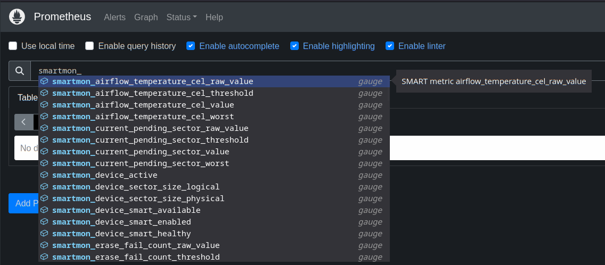
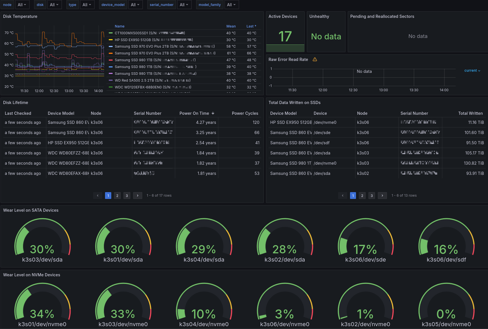

# SMARTmon Exporter with Dashboard

`smartmon` is a [Textfile Collector](https://github.com/prometheus/node_exporter#textfile-collector) for Prometheus Node Exporter to gather information on SATA HDDs, SSDs and NVMe devices.  A Grafana Dashboard for this exporter is included.

## Requirements

* [Node Exporter](https://github.com/prometheus/node_exporter) with [textfile collectors](https://github.com/prometheus/node_exporter#textfile-collector) enabled
* Cronjob to run SMARTmon Exporter to generate textfile for Node Exporter
* [smartmontools](https://www.smartmontools.org/) installed and configured performing scheduled device tests
* [moreutils](https://joeyh.name/code/moreutils/) package which provides [sponge](https://manpages.ubuntu.com/manpages/jammy/man1/sponge.1.html) utility for atomically write output to file

### How do I set it up?

1. Configure Node Exporter to enable text file collectors.

    Create directory for Node Exporter Textfile Collector to scan:

    ```shell
    mkdir -p /var/lib/node_exporter/textfile_collector
    ```

    Added the following to Node Exporter command-line configuration:

    ```shell
    --collector.textfile.directory=/var/lib/node_exporter/textfile_collector
    ```

    * When using Node Exporter deployed in Kubernetes, the path to the host directory outside the pod will be different, such as: `/host/root/var/lib/node_exporter/textfile_collector`

2. Place `smartmon.sh` in `/usr/local/bin/` and give it execute permissions.

3. Create a cron entry to run `smartmon.sh` at regular interval such as every 5 minutes:

    ```shell
    $ sudo crontab -e

    # Opens in text editor
    ```

    Add the following line to run every 5 minutes:

    ```text
    */5 * * * * /usr/local/bin/smartmon.sh | /usr/bin/sponge /var/lib/node_exporter/textfile_collector/smartmon.prom
    ```

* The `sponge` utility will help prevent a partially written `smartmon.prom` file being consumed by Node Exporter Textfile Collector.

---

Once the cron job has executed, you should find metrics within Prometheus:



---

The Grafana dashboard `smartmon.json` can be imported to Grafana to provide visualization of monitored devices:



* Visualization of storage devices monitored within my Kubernetes cluster.
